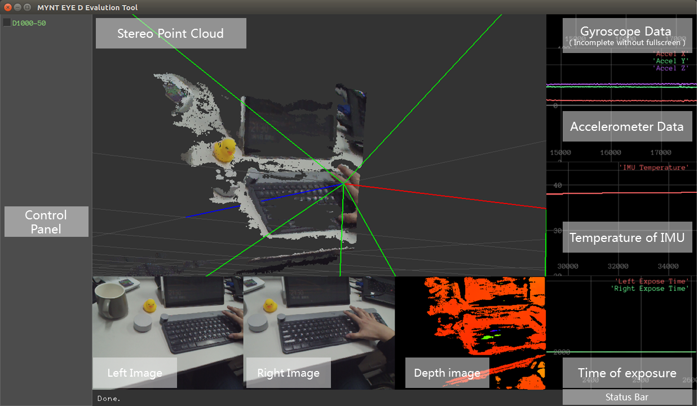

# Evaluation tool for MYNT_EYE_D Cameras

English | [中文](./ReadMe_ch.md)

A Evaluation tool for MYNT EYE stereo cameras. I designed it for D1000-50. Tested on Ubuntu 16.04.

Near scenes:


Distant scene:


> It will take some time for the GIFs (2.2MB, 3.2MB) to load).

## Feature

- [x] Display stereo images and point cloud (computed by this tool) in one window (depended on Pangolin and OpenCV)
- [ ] Give an intuitive presentation for camera's rotation (based on IMU data)
- [x] Drawing IMU raw data (include temperature) over time
- [ ] Time stamp drawing of three sensors ( left and right cameras, and IMU)
- [x] Drawing exposure time over time

## Device

This tool support D1000-100 and D1000-50. The tested device's details as Follows:

Item|Value
:-:|:-:
Type|MYNT-EYE-D1000-50
Firmware Version|1.4
Hardware Version|2.0
SDK Version|4.12.9

## Dependencies

- CMake
- Pangolin (included, modified based on version 0.5)
- Gflags (included)
- GLog (included， modified)
- Eigen 3.3 or above
- OpenCV 3.0 or above
- Indicators (included, but now wasn't used)
- MYNT EYE D SDK (4.12.9 or above)

## Build

### 1. Compile Included Dependencies

```
# build gflags
cd ./ThirdParty/gflags 
mkdir build && cd build 
cmake .. && make 
```

```
# build GLog
cd ./ThirdParty/glog 
mkdir build && cd build 
cmake .. && make 
```

```
# build Pangolin
cd ./ThirdParty/Pangolin 
mkdir build && cd build 
cmake .. && make 
```

### 2. Set Libraries path (Eigen and OpenCV)

If your Eigen and OpenCV were installed in the default path, you just need to comment following codes in [CMakeLists.txt](./CMakeLists.txt):

```
include_directories("/home/guoqing/libraries/eigen_333/include/eigen3")
```
and
```
set(OpenCV_DIR "/home/guoqing/libraries/opencv_331/share/OpenCV")
```

If Eigen or OpenCV were not installed in the default paths, please modify the paths of the eigen Library's header file, or set `OpenCV_DIR` in [CMakeLists.txt](./CMakeLists.txt) to the path which contains `OpenCVConfig.cmake`.

### 3. Build Project

Just run:

```
mkdir build && cd build
cmake ..
make
```

The generated executable file will be placed in the folder `bin`.

## Usage

Plug in the camera (note that the camera may need to be plugged in  **USB3.0** ), and then execute:

```
./bin/eva
```

About Viewer:



Tool's function is not perfect, so ... just use it for fun （┑(￣Д ￣)┍）

In addition, the log file will be saved in the `log` folder of the project by default. This script [cleanLogs.sh](./cleanLogs.sh) can help you to clean these log files:

```
./cleanLogs.sh
```

## Known Bugs

- When you pressed "Ctrl+C" before the camera initialized, a segment fault will occurred.


